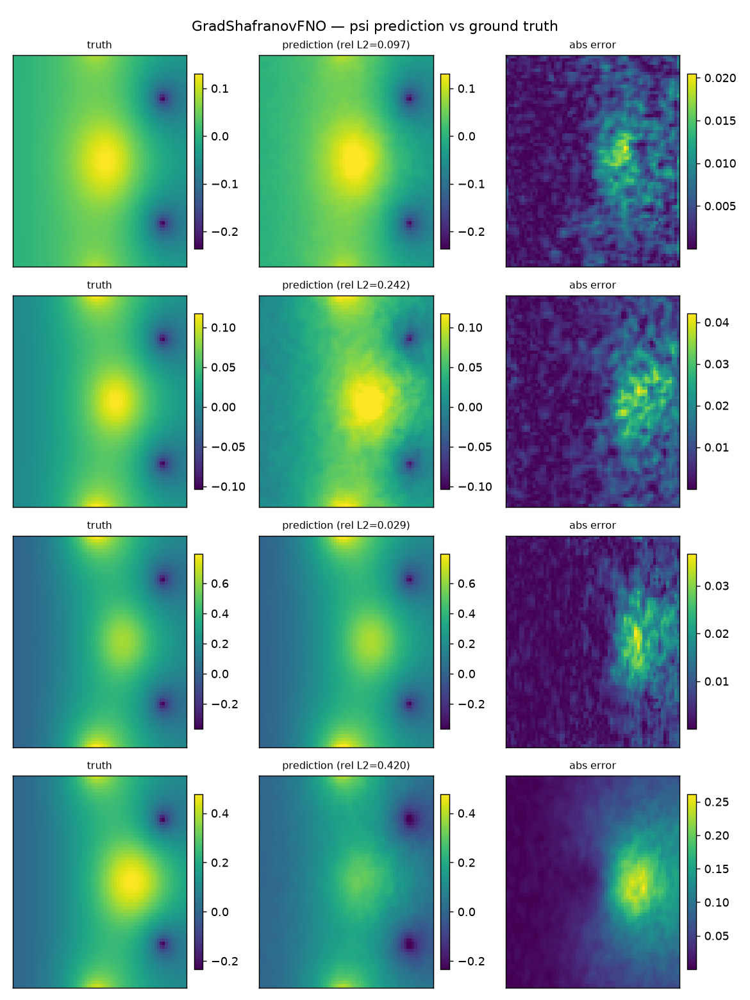

# plasma-gsfno

Fast FNO surrogate for the **forward** Grad-Shafranov MHD equilibrium solve — turning the iterative GS solver (10–100 ms) into sub-millisecond inference. This is a forward solver surrogate (profiles + vacuum field → flux), not an EFIT-style inverse reconstruction from magnetic sensors.

Built on [Solaris](../Solaris) — a physics AI framework for neural operators on AMD ROCm.

## Quick Start

```bash
# Activate the Solaris venv (shared)
source ~/projects/research/Solaris/.venv/bin/activate

# Install in editable mode
pip install -e ".[dev]"
```

To include real-machine data dependencies (FreeGS equilibrium solver and MDS+ data access):

```bash
pip install -e ".[dev,gw]"
```

## Architecture

The model is a forward Grad-Shafranov solver surrogate. It maps vacuum flux, normalized geometry, and pressure/current-profile inputs to the dimensionless total poloidal flux ψ(R,Z):

```
Input: (B, 5, 65, 65) — [ψ_vac, R_norm, Z_norm, p'(ψ_N) lifted, ff'(ψ_N) lifted]
FNO(in=5, out=1, hidden=64, layers=4, modes=16, dim=2)
Output: ψ_total(R,Z) — dimensionless poloidal flux
```

Training data is generated via FreeGS free-boundary forward equilibrium solves with a GS-residual validation gate. The model uses global dimensionless scaling (no per-sample normalization). The ψ_vac channel is computed via coil/vacuum Green's functions—no answer leak into the geometry inputs.

The model trains as a supervised neural operator on this physics-validated data. An optional GS-residual loss term exists but is **off by default** (`lambda_phys: 0`): it currently uses R-indexed lifted profiles, which approximate rather than equal the exact flux-evaluated GS source terms. A correct flux-evaluated physics-informed loss is future work; physics validity is presently enforced at data-generation time.

## Results

Trained on 20,000 FreeGS free-boundary equilibria (65×65, TestTokamak; 16k/2k/2k train/val/test). Evaluated on the held-out test split:

| Metric | Value |
|--------|-------|
| R² | **0.975** |
| Relative L2 (mean) | **0.120** (12%) |
| RMSE | 0.019 |
| Trivial baseline — predict ψ_vac (relative L2) | 1.078 (108%) |
| Inference latency (FNO, 1×H100) | **1.2 ms** |
| GS solve time (FreeGS, CPU) | ~0.79 s |

The model is **~9× more accurate than the trivial "copy the vacuum field" baseline**, confirming it genuinely learns the plasma contribution to the flux rather than echoing an input. Inference is ~**650× faster** than the iterative solve (GPU surrogate vs CPU solver).

Reproduce with `bash deploy/runpod/train_and_eval.sh` (see [deploy/runpod](deploy/runpod)).

### Prediction vs. ground truth



**TL;DR:** each row is one held-out test equilibrium; the three columns are **ground-truth flux ψ | model prediction | absolute error**. The prediction reproduces the global flux structure (bright plasma core, dark coil regions) on equilibria it never saw in training. The residual error is concentrated in the plasma core and small relative to the field; per-sample relative L2 ranges from ~0.03 (easy) to ~0.42 (hard), averaging 0.12 across the test set.

## License

Apache 2.0
